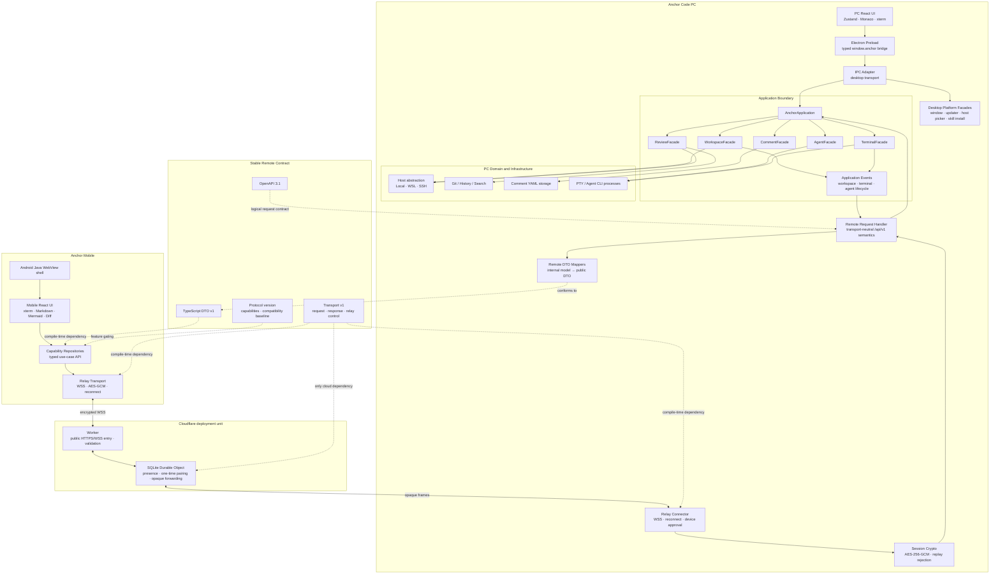
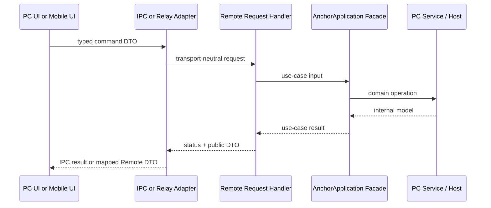
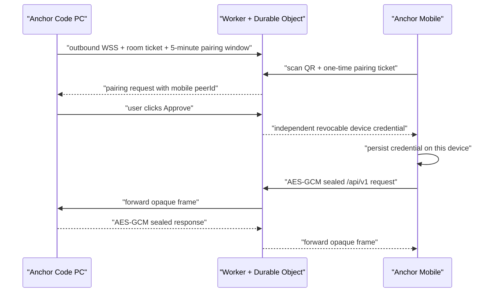
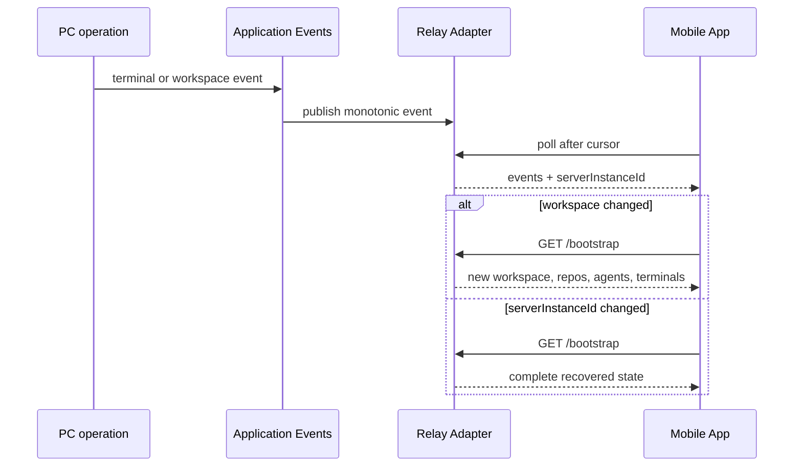

# Anchor Code architecture

## Goals

Anchor Code PC owns workspace, Git, comments, Agent processes, and PTYs. The
Android companion is a remote client. PC and Mobile evolve independently behind
an additive, versioned protocol; neither UI imports the other's implementation.

Mobile networking uses one transport: the end-to-end encrypted Anchor Relay.
The transport remains below the stable Remote API boundary. See
[REMOTE_CONNECTIVITY_PLAN.md](REMOTE_CONNECTIVITY_PLAN.md) for the detailed,
beginner-oriented design and rollout criteria.

## Software architecture



## Runtime flows

### Commands



### Encrypted relay pairing



The room ticket and device credentials authenticate relay connections but are
not encryption keys. The QR-only `secret` derives the AES-256-GCM session key;
Cloudflare never receives it as a query parameter, control frame, or stored
value. Routing metadata is authenticated as AEAD additional data, and each
direction rejects repeated sequence numbers.

### Synchronization and reconnect



## Module ownership

- `contracts/remote-api`: independently versioned business DTOs, full OpenAPI,
  capabilities, compatibility policy, and the released v1 baseline fixture.
- `contracts/remote-transport`: independently versioned request/response,
  encrypted-frame, pairing, presence, and device-control envelopes.
- `electron/application`: reusable PC use cases, the transport-neutral
  `RemoteRequestHandler`, and the application event bus.
- `electron/ipc`: desktop transport plus explicitly PC-only platform adapters.
- `electron/remote`: Relay Connector, encryption, replay protection, and
  connection lifecycle. The adapter depends on
  `RemoteRequestHandler`, not Host, PTY, or Mobile UI.
- `electron/adapters/remote`: allow-list DTO mapping; internal service fields are
  never serialized by object spread.
- `electron/services` and `electron/host`: domain/infrastructure implementation,
  unavailable to Mobile.
- `mobile/web/src/api.ts`: stable request methods backed by Relay transport.
- `mobile/web/src/transport`: encrypted Relay, timeout, reconnect, and browser
  WebCrypto implementation.
- `relay/cloudflare`: separately deployed Worker and SQLite Durable Object. It
  imports only the transport contract and cannot import Electron or Mobile UI.
- `relay/local`: behaviorally equivalent local relay used by integration tests.
- `mobile/web/src/repositories.ts`: all `/api/v1` paths and capability decisions.
- `mobile/web/src/App.tsx`: mobile interaction and presentation; no API paths.
- `mobile/android`: thin WebView APK shell with an independent Android version.

## Enforced dependency rules

1. Mobile imports public types only from `@anchor-code/remote-contract/v1`.
2. Mobile UI never constructs `/api/v1` paths; repositories own endpoints.
3. Relay adapter code imports neither `HostManager` nor `TerminalService`.
4. Remote results cross explicit DTO mappers before serialization.
5. Core IPC commands call Application Facades. Native dialogs, app updates,
   host-profile setup, and skill installation are documented PC-only platform
   capabilities and are not part of the Mobile contract.
6. `/api/v1` is additive. Breaking changes require `/api/v2` and a transition
   window serving both majors.
7. Optional UI is gated by `/meta` capabilities. Legacy v1 servers without
   `/meta` retain the original v1 feature assumptions.
8. Application events synchronize Agent/Terminal lifecycle and Workspace
   changes. `serverInstanceId` forces a full Mobile bootstrap after PC restart.
9. WSS Relay is the only Mobile transport and enters the shared
   `RemoteRequestHandler`; the desktop UI reaches the same Application Facades
   through IPC.
10. Relay cloud code forwards opaque frames only. It never imports Remote API
    handlers, DTO mappers, filesystem code, Agent services, or UI components.

The boundary, DTO, OpenAPI route, compatibility baseline, and Remote API tests
fail when these rules regress.

## Versioning and release boundaries

| Artifact | Version source | Dependency lock | Release workflow |
|---|---|---|---|
| PC desktop | root `package.json` | root `package-lock.json` | `.github/workflows/release.yml` |
| Remote protocol | `contracts/remote-api/package.json` | v1 compatibility fixture | validated by CI |
| Mobile Web | `mobile/web/package.json` | `mobile/web/package-lock.json` | built by Mobile CI |
| Android APK | Gradle `anchorMobileVersionCode/Name` | Gradle wrapper | `.github/workflows/mobile-release.yml` |
| Relay transport | `contracts/remote-transport/package.json` | transport v1 tests | PC, Mobile, and Relay CI |
| Cloudflare Relay | `relay/cloudflare/package.json` | isolated lockfile | Wrangler deployment |

Mobile dependency updates do not modify the PC lockfile. Mobile release tags use
`mobile-vX.Y.Z`; PC release tags remain `vX.Y.Z`.

## Compatibility verification

CI currently enforces:

- PC typecheck, unit/integration tests, and production build.
- Mobile independent install, typecheck, Web build, and APK build.
- OpenAPI completeness against all published v1 paths.
- Additive compatibility against `fixtures/v1-baseline.json`.
- Application/HTTP dependency boundaries and DTO field allow-lists.

When at least two signed binary releases are retained, extend Mobile CI with the
binary matrix: current PC against the previous APK, and current APK against the
oldest supported v1 PC. The checked-in v1 fixture already prevents source-level
removal of the paths and capabilities required by those clients.

## Local verification

```bash
npm run typecheck
npm run test:unit
npm run test:integration
npm run build
npm run mobile:typecheck
npm run mobile:web
npm run mobile:apk
npm --prefix relay/cloudflare run typecheck
npm --prefix relay/cloudflare run deploy -- --dry-run
```
