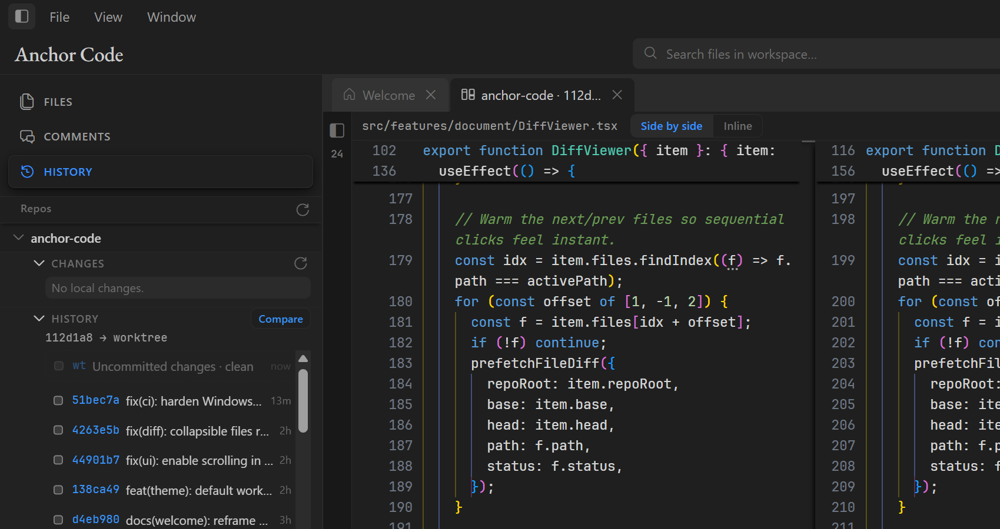
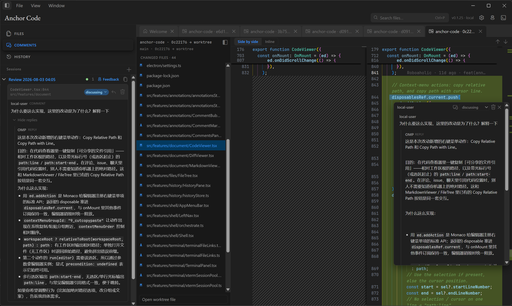
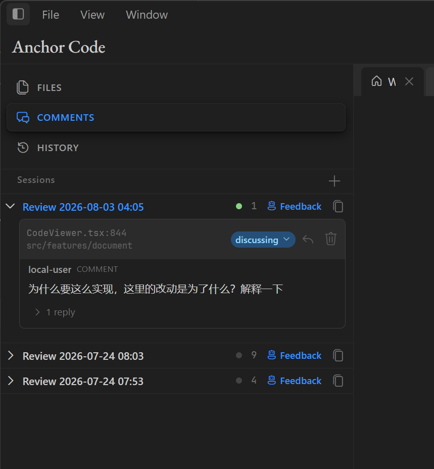

# Anchor Code

**A human-in-the-loop workspace for agentic coding.**

**Agent it. Review it. Feed it back.**

Anchor Code brings your codebase, technical documents, file management, Git history, diffs, review comments, and agent CLIs into one workspace. Agents keep working in their native terminal environment while you stay in control of the context, changes, feedback, and final outcome.

[中文](README.zh-CN.md) · [Download Anchor Code](https://github.com/Roboaholic/anchor-code/releases)

## Keep agents moving. Keep humans in control.

Agentic coding has accelerated implementation, but the surrounding human workflow remains fragmented. Code lives in an editor, plans live in Markdown, changes live in Git, feedback lives in chat, and the agent runs in a terminal.

Anchor Code reconnects these surfaces. Read the project, run the agents you already use, inspect their actual changes, discuss exact lines, send structured feedback, and decide when the result is ready.

| Explore the workspace | Work with agents | Inspect changes | Close the loop |
|---|---|---|---|
| Browse files, search code, and read source, Markdown, and Mermaid documents. | Run native Agent CLI and TUI sessions with workspace context, model selection, and reasoning settings. | Review Git history, branch and worktree state, and complete changes in side-by-side or inline diffs. | Anchor comments to code, send review sessions to agents, and verify replies and revisions in context. |

## Git history built for inspection

Select any two commits, or compare a commit with the current worktree. Anchor Code presents the complete changed-file set and diff in one focused workspace, with side-by-side and inline viewing modes.

Branch state, revisions, files, source lines, and comments stay together. A comment created in a diff retains its branch, base, head, file, and line-range context, giving both the human and the agent an exact reference.

## Feedback that returns with an answer

Comments are anchored to exact selections in source code and rendered Markdown. Review sessions distinguish questions (`discussing`), concrete change requests (`need_modify`), and resolved threads (`closed`).

The **Feedback** action sends the structured session to the selected agent. The agent can reply in the original thread, implement requested changes, and update its status. The next diff and the full discussion remain available for human verification.

## Why Anchor Code

Zed and VS Code center the editing experience. Warp centers the terminal and agent experience. Anchor Code connects files, documents, Git inspection, review context, and Agent CLIs around a continuous human-in-the-loop workflow.

`✅` built in · `△` available through a broader workflow, integration, or extension · `❌` no comparable workflow

| Capability | Anchor Code | Zed | VS Code | Warp |
|---|---|---|---|---|
| Files, code, and Markdown | ✅ Built in | ✅ Built in | ✅ Built in | △ Terminal-oriented |
| Integrated terminal and Agent CLI | ✅ Native CLI/TUI | ✅ Integrated terminal | ✅ Integrated terminal | ✅ Core experience |
| Git commit history | ✅ Review-oriented history | ✅ Project/file history | ✅ Source Control Graph | △ CLI and integrations |
| Commit ↔ Commit / Worktree comparison | ✅ First-class Diff workspace | △ Commit and file diffs | △ Built-in Git views; GitLens adds deeper comparison | △ Primarily CLI-driven |
| Comments anchored to code and diffs | ✅ Review Sessions | △ Editor/collaboration workflows | △ Extensions or PR integrations | ❌ |
| Structured feedback returned to CLI agents | ✅ Stateful feedback loop | △ Agent/editor context | △ Depends on Agent extensions | △ Terminal conversation |

The difference is what happens around the diff. Anchor Code makes comparison, code-anchored discussion, Agent handoff, and human verification one native path.

Comparison references: [Zed Git](https://zed.dev/docs/git), [VS Code Source Control](https://code.visualstudio.com/docs/sourcecontrol/overview), [GitLens features](https://help.gitkraken.com/gitlens/gitlens-features/), and [Warp documentation](https://docs.warp.dev/).

## Stay in the loop away from your desk

**Anchor Mobile** extends the workspace to Android phones and tablets. Review code and Markdown, inspect worktree diffs, manage comments, and operate Agent terminal sessions running on your PC.

Pair with a QR code through the end-to-end encrypted Anchor Relay. Files, Git operations, shells, and agents remain on the PC; the Relay forwards encrypted frames. See [Anchor Mobile](mobile/README.md) for setup and APK instructions, and [Anchor Relay](relay/cloudflare/README.md) for deployment details.

## Supported agents and environments

**Agent CLIs:** Claude Code, Codex, Gemini CLI, Aider, Grok, OMP, Cursor Agent, and custom profiles.

**Workspaces:** Local, WSL, and SSH.

**Desktop:** Windows, macOS, and Linux.

**Companion:** Android phones and tablets.

## Quick start

1. Download Anchor Code from [Releases](https://github.com/Roboaholic/anchor-code/releases).
2. Open a Local, WSL, or SSH workspace.
3. Launch an Agent CLI in the built-in terminal, or open a repository with existing changes.
4. Read the code and documentation, then use **History** to inspect commits or the worktree.
5. Add comments to exact selections and mark actionable requests as `need_modify`.
6. Use **Feedback** to hand the session to an agent, then inspect the next diff and close resolved threads.

Install the **Anchor Review** skill from **Settings → Agent skill**, or accept the workspace prompt. It teaches compatible agents how to read Anchor Code sessions, process `need_modify` comments, reply to threads, and update review status.

## Download

| Platform | Installer | Portable / other |
|---|---|---|
| Windows | `Anchor.Code-*-win-x64.exe` (NSIS setup) | `Anchor.Code-*-win-x64-portable.exe` |
| macOS | `Anchor.Code-*-mac-*.dmg` | `.zip` |
| Linux | `.AppImage` or `.deb` | - |

Anchor Code requires system `git` on the selected host. WSL and SSH workspaces require their corresponding host environment and connection to be available.

## License

[Apache License 2.0](LICENSE)
