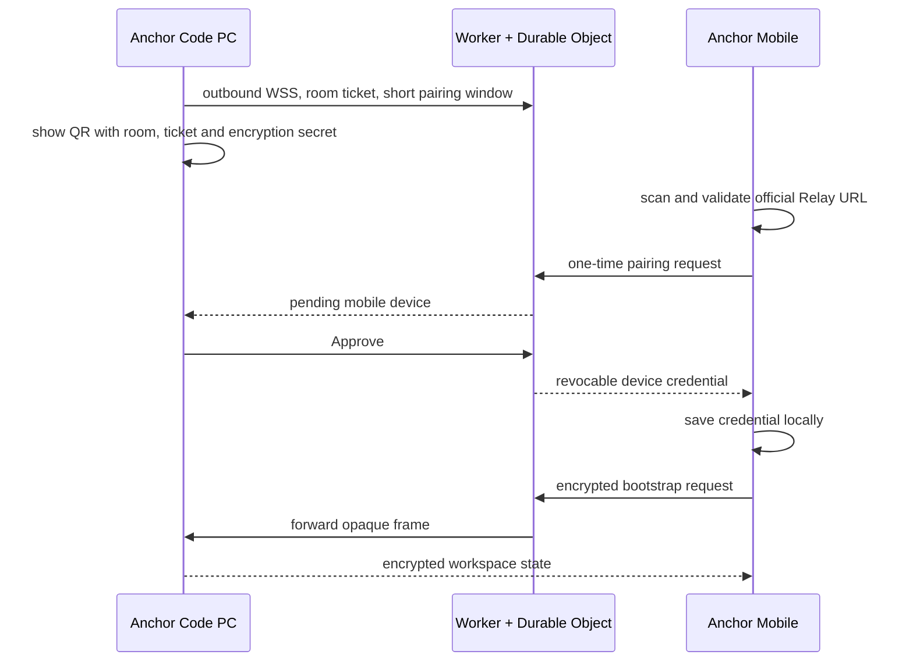

# Anchor Code 单一中继连接方案

## 1. 最终使用形式

用户只安装两个产品：

1. PC 安装并运行 Anchor Code。
2. 手机安装 Anchor Mobile。
3. PC 在 **Settings -> Mobile access** 开启移动访问。
4. 手机扫描 PC 显示的二维码。
5. PC 批准这台手机。

App 不提供 IP、端口或令牌输入框，PC 不开放移动访问监听端口，也不要求用户安装
其他组网或隧道程序。PC 和手机都主动连接固定入口：

`https://anchor-code-relay.anchor-code-mobile.workers.dev`

当前已验证：手机网络能访问该域名时，可以通过 Relay 连接 PC。在部分国内网络中
`workers.dev` 可能无法直接访问，此时需要手机使用可访问该域名的网络路径。后续如
绑定自定义域名，只替换固定服务入口，不增加第二种传输方式。

## 2. 小白理解

可以把 Relay 理解成一个只负责转交密封信的前台：

- PC 先到前台登记自己所在的房间。
- 手机扫描二维码后，拿着一次性票据进入同一房间。
- PC 确认这台手机后，前台给手机签发独立设备凭据。
- 手机和 PC 发送的内容在各自设备上加密，前台只转发密文。

Cloudflare Worker 是公网入口，负责检查请求格式并把连接送到正确房间。Durable
Object 是房间管理员，负责在线状态、一次性配对和设备凭据。它们都不执行 Git、
文件、Agent 或终端操作，这些能力始终留在 PC Anchor Code 中。

## 3. 软件结构

```mermaid
flowchart LR
  subgraph Phone["Anchor Mobile"]
    UI["Mobile UI"]
    Repo["Use-case Repositories"]
    MT["Relay Transport\nWebSocket + AES-GCM"]
    UI --> Repo --> MT
  end

  subgraph Cloud["Cloudflare"]
    Worker["Worker\nHTTPS/WSS entry"]
    Room["Durable Object\nroom + pairing + presence"]
    Worker --> Room
  end

  subgraph PC["Anchor Code PC"]
    RT["Relay Connector\noutbound WSS"]
    Handler["RemoteRequestHandler"]
    App["AnchorApplication Facades"]
    Domain["Workspace + Git + Comments + Agent + PTY"]
    RT --> Handler --> App --> Domain
  end

  MT <-->|"end-to-end encrypted frames"| Worker
  Room <-->|"opaque forwarding"| RT
```

PC UI 通过 Electron IPC 调用 Application Facade，手机请求通过 Relay 和
`RemoteRequestHandler` 调用同一组 Facade。双方依赖版本化契约，不互相导入 UI 或
实现代码。

## 4. 首次配对

二维码有短有效期，并且一次配对只能使用一次。PC 未批准前，手机不能发送业务请求。
批准后手机保存自己的设备凭据，后续启动可以自动重连。PC 可以单独撤销某台设备。

## 5. 加密与权限

- 业务载荷使用 AES-256-GCM 端到端加密。
- 二维码中的 `secret` 只用于在 PC 和手机派生会话密钥，不发送给 Cloudflare。
- 房间票据与设备凭据负责身份校验，不直接作为加密密钥。
- 每个加密帧带会话 ID 和递增序号，双方拒绝重复帧。
- Relay 设置消息大小、连接数和速率限制。
- 手机只能调用版本化 Remote API，不直接获得文件系统或 Shell 权限。
- 工作区路径、Git、评论、Agent 和 PTY 操作由 PC Application Facade 校验。

## 6. 稳定接口

工程保留两份独立契约：

- `contracts/remote-api/v1`：业务 DTO、能力声明和逻辑 `/api/v1` 请求语义。
- `contracts/remote-transport/v1`：配对、设备控制、加密请求/响应和在线状态帧。

逻辑 `/api/v1` 不代表一个公网 HTTP Server。请求会被封装进加密 WebSocket 帧，
Relay 只负责传递。新增能力必须先扩展契约和 capability，再分别更新 PC 与 App。
破坏性变更需要新的主版本和兼容窗口。

## 7. 重连与同步

- PC Relay Connector 使用指数退避自动重连。
- 手机断网后保留已批准的设备凭据并自动重连。
- Agent/Terminal/Workspace 事件使用单调游标同步。
- 检测到 PC 实例 ID 变化时，App 重新执行完整 bootstrap。
- 切换工作区时，PC 和 App 同步到同一活动工作区。
- Relay 只保存连接和设备认证所需的最小元数据，不保存业务明文。

## 8. 用户可见故障

| 情况 | App 提示 | 用户动作 |
|---|---|---|
| Relay 域名不可达 | 无法连接 Anchor Relay | 切换到能访问固定 Relay 域名的网络 |
| PC 未在线 | PC 离线 | 启动 Anchor Code 并开启 Mobile access |
| 二维码过期 | 配对二维码已过期 | PC 点击 Refresh pairing code 后重新扫描 |
| 等待批准 | 等待 PC 批准 | 在 PC 设置页点击 Approve |
| 设备被撤销 | 设备凭据无效或已撤销 | 重新扫码并由 PC 批准 |
| 临时断网 | 正在重连 | 保持 App 打开，恢复网络后自动继续 |

## 9. 验收标准

1. PC 启动移动访问后不监听 `0.0.0.0` 或局域网移动端口。
2. App 连接页只显示扫码入口，不显示地址或令牌表单。
3. 非官方 Relay 二维码被 App 拒绝。
4. 首次扫码必须在 PC 批准后才能读取工作区。
5. 批准后的设备可以自动重连，也可以由 PC 单独撤销。
6. Cloudflare 日志和存储中不出现源代码、Prompt、终端输出或 API 结果明文。
7. Review、Files、Comments 和 Agent 都通过同一版本化 Remote API 工作。
8. PC 和 App 可以按照兼容策略独立发布。
9. Worker 健康检查、跨平台加密测试、PC 测试、Mobile 构建和 APK 构建全部通过。

## 10. 发布与运维

- Worker 与 Durable Object 位于 `relay/cloudflare`，独立部署和版本管理。
- Worker 健康地址为 `/health`，返回服务名和协议版本。
- PC、Mobile、Remote API、Transport 和 Worker 分别维护版本边界。
- 监控只记录连接成功率、错误码、延迟、帧大小和用量，不记录业务载荷。
- 固定域名变更属于传输配置升级，需要 PC 与 App 同时支持明确的迁移窗口。
