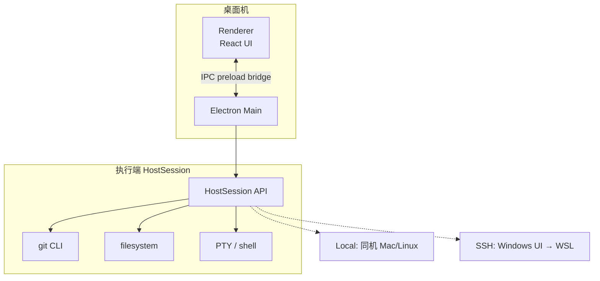
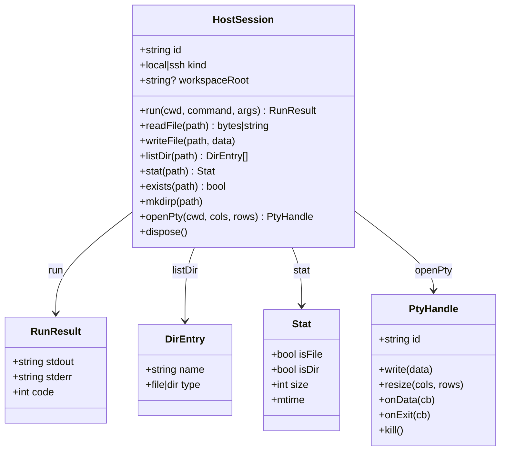
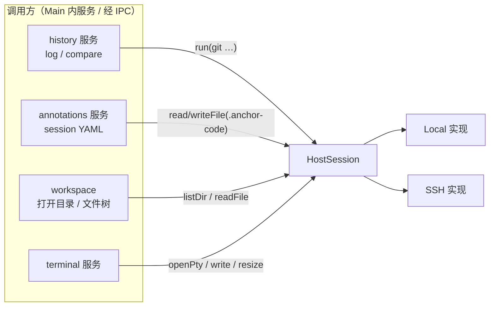
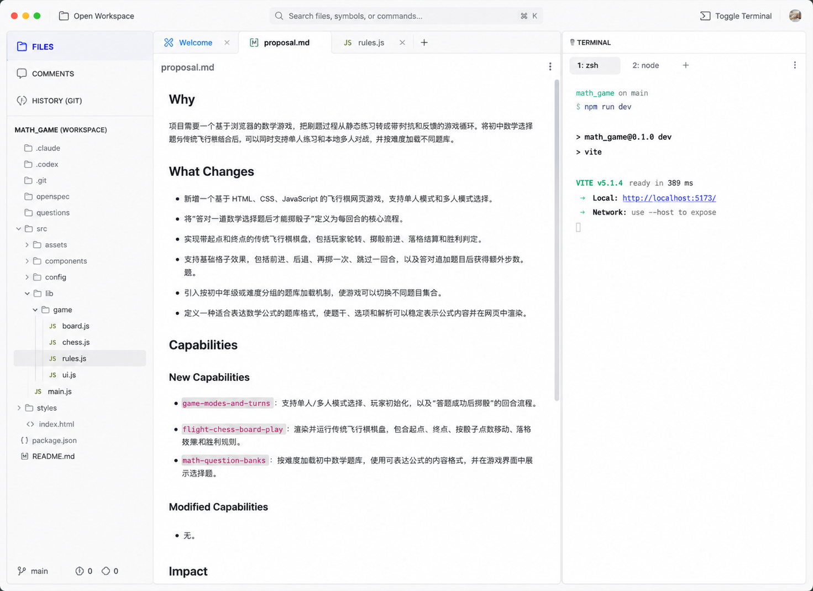
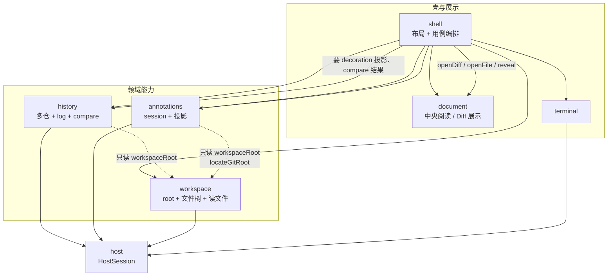
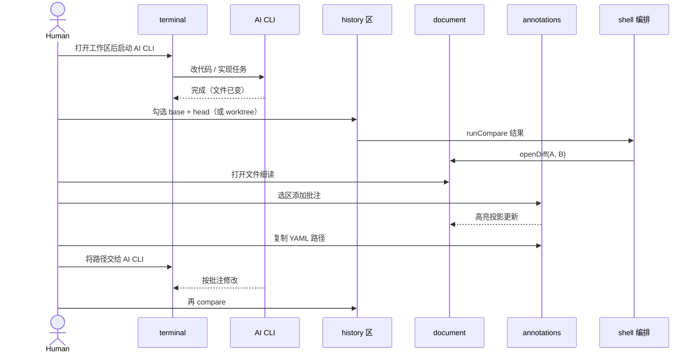
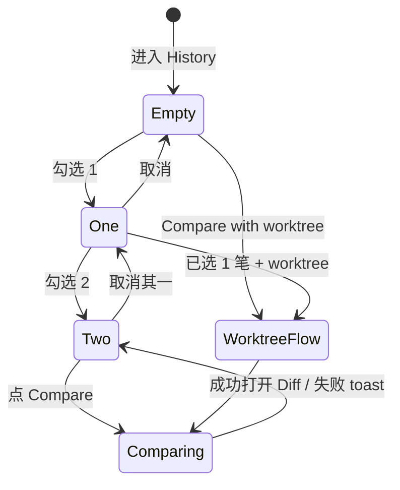
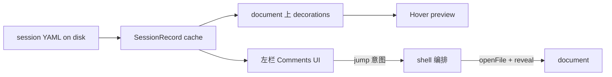

# Anchor Code — Design

状态：草案  
日期：2026-07-19  
依据：`PROPOSAL.md`、`DISCUSSION.md`  
**UI 主参考图**：[`ui-reference.png`](./ui-reference.png)（工作区壳层：左导航 + 中央阅读 + 右多标签 Terminal）  
前序：`~/anchor-code-proposal` 仍可用于评论 YAML 形状等历史材料；**壳层与视觉以 `ui-reference.png` 为准**，不再以旧 proposal 截图或 demo 为布局基线

---

## 1. 设计目标与范围

### 1.1 一句话

为 **AI coding 的人在回路** 提供本地桌面审计面：细读、任意两点 diff 对照、选区批注，并把 session YAML 路径交回终端中的 AI CLI。本应用不取代 agent，不做通用 IDE。

### 1.2 第一版（v1）做哪些、明确不做哪些

这里的 **v1** = 第一版可交付范围，不是「产品永远不做」。  
表的左列是 **本设计承诺要落地的能力**；右列是 **同期刻意不做**（避免做成 IDE / 远程开发全家桶），以后若要做需另开设计。

| v1 要做（范围内） | v1 不做（范围外） |
|------------------|-------------------|
| HostSession：本机 Local，以及 Windows→WSL 的 SSH | 完整 VS Code Remote 协议、任意远程开发服务器产品化 |
| 打开一个工作区目录、文件树、代码/Markdown **只读** | 完整编辑体验、调试器、以 LSP 为中心的智能感知 |
| Git 区发现多 root、勾选两 commit 比 diff、commit↔worktree | 拓扑 Git Graph 画图、GitHub/GitLab PR 同步 |
| 单 active session 评论（代码+MD）、悬停/侧栏、复制 YAML 路径 | 多个 active session 并行、diff hunk 上批注、云端协作 |
| 右侧多标签 Terminal，cwd = 工作区 | 内置 AI agent 会话编排 UI（AI 仍用终端里的 CLI） |

### 1.3 本文写法

- 回答 **怎么切、状态在哪、主路径怎么走**；不重复 proposal 的「为什么」。
- 图：结构/数据流用 **Mermaid**；布局与状态机用 **ASCII**（更贴控件心智）。
- 实现可微调字段名；**模块边界与「中央不持有 multi-repo」约束** 不得暗中破坏。

---

## 2. 系统上下文与进程边界

### 2.1 运行时拓扑



| 进程/位置 | 允许 | 禁止 |
|-----------|------|------|
| Renderer | 布局、编辑器、调用 `window.anchor.*` | 直连 PTY、SSH、任意 `child_process` |
| Main | HostSession、IPC、窗口、剪贴板写路径 | 业务 UI 状态机（可持有会话句柄） |
| 执行端 | git、读文件、写 `.anchor-code`、shell | 无 |

**路径规则**：一切 path 字符串为 **执行端视角**（POSIX 风格为主）。Windows 上 v1 只打开 WSL 内路径；UI 不展示 `\\wsl$\` 混用。

### 2.2 HostSession 职责

HostSession 是跨端唯一 I/O 门面。业务模块（`workspace` / `history` / `annotations` / `terminal` 等）只依赖此接口，不区分 Local/SSH。底层会 `run("git", …)`，但 **应用模块不叫 git**，避免被理解成「裸包一层 CLI」。

#### 2.2.1 接口草图（逻辑）

HostSession 是执行端门面：业务只依赖这一层，不直接区分 Local / SSH。能力分成四组——**元数据、命令、文件、终端**。



数据流关系（谁调用谁）：



要点简述：

- `workspaceRoot`：当前打开的工作区根路径（执行端 path）；未打开时为 null。
- `run`：跑 git 等命令；返回 stdout/stderr/退出码。
- 文件一组：供文件树、只读打开、读写评论 YAML。
- `openPty`：多标签终端的每个 tab 对应一个 `PtyHandle`。
- `dispose`：切换工作区或断开 SSH 时释放连接与 PTY。

#### 2.2.2 Local vs SSH

| 能力 | Local | SSH（WSL） |
|------|-------|------------|
| `run` | `spawn`/`execFile` | `exec` over SSH 或 `ssh host cmd` |
| 文件 | Node `fs` | SFTP 或 `cat`/`printf` 封装（实现选一，须稳定） |
| PTY | `node-pty` | SSH `shell` channel / request pty |
| 配置 | 工作区 path | host、port、user、auth（密钥路径）、远程默认 cwd 可选 |

SSH 配置存 **应用本地 settings**（用户目录），**永不**写入被打开的 git 仓库。

#### 2.2.3 错误模型

统一错误形状，便于 UI toast：

```text
HostError
  code: "not_found" | "permission" | "disconnected" | "timeout" | "failed" | "not_git"
  message: string          # 人类可读
  cause?: string           # stderr / 底层信息（可折叠）
```

SSH 断线：标记 session `disconnected`；Terminal 标签显示可重连；git/文件操作失败明确提示，不静默空结果。

### 2.3 IPC 表面（逻辑分组）

```text
window.anchor
  workspace.*          # 打开工作区、recent
  fs.*                 # 或并入 workspace
  history.*            # discover / log / compare（内部才调 git CLI）
  annotations.*        # session 读写、复制路径
  terminal.*           # open / write / resize / close
  clipboard.writeText
  shell.getVersion
```

`history` 的解析可在 Main 完成（纯函数可进共享包），Renderer 只收结构化结果。`annotations` 的 YAML parse/serialize 纯逻辑放 `core/`，**读写文件必须经 Host**。IPC 命名与 **领域模块** 对齐，不要出现 `git.*` 这种像裸 CLI 的 API 面。

---

## 3. 信息架构与壳层

### 3.0 UI 主参考

实现壳层与默认布局时，**以仓库内参考图为准**：



图中已对齐的产品决策（实现应对齐，而不是再发明另一套壳）：

| 区域 | 参考图中的形态 |
|------|----------------|
| 顶栏 | 左 **Open Workspace**；中 **Search files, symbols, or commands…**（示意 ⌘K）；右 **Toggle Terminal**（+ 可选账户区） |
| 左栏模式 | 纵向带图标+文案：**FILES** / **COMMENTS** / **HISTORY (GIT)**；当前模式高亮（如图中蓝色 FILES） |
| 文件树 | 工作区标题如 `MATH_GAME (WORKSPACE)`；树节点带类型图标；选中行浅底 |
| 左栏底 | 分支名（如 `main`）与简要 git 状态数字（后置可深化，v1 可占位） |
| 中央 tabs | 打开项横条：图标 + 文件名 + 关闭；可有 Welcome；**+** 开新（v1 行为可简化） |
| 中央内容 | Markdown **Rendered** 阅读面（如图 `proposal.md`）；非默认 Monaco 编辑器主屏 |
| 右侧 | 标题 **TERMINAL**；**多标签**（如 `1: zsh`、`2: node`）+ **+**；xterm 输出区 |
| 整体 | 浅色、细分割线、flat、桌面工具感；**无**右侧 Code review 大卡片墙 |

旧 `~/anchor-code-proposal` 截图仅作历史对照；**冲突时以本图为准**（尤其右侧必须是 Terminal）。

### 3.1 布局（与参考图同构的 ASCII）

```text
┌─ TopBar ──────────────────────────────────────────────────────────────┐
│ [□ Open Workspace]   [🔍 Search files, symbols, or commands…  ⌘K]    │
│                                          [Toggle Terminal]  [(avatar)]│
├─ Left ────────────────┬─ Document ─────────────────┬─ Terminal ──────┤
│ FILES          ←active│ [Welcome][proposal.md][JS+]│ TERMINAL     ⋮  │
│ COMMENTS              │ ─────────────────────────-│ [1:zsh][2:node][+]│
│ HISTORY (GIT)         │ proposal.md            ⋮  │                  │
│ ─────────────────     │                           │ $ npm run dev    │
│ MATH_GAME (WORKSPACE) │  # Why                    │ …               │
│  📁 .claude           │  … rendered markdown …    │                  │
│  📁 src / …           │                           │                  │
│  JS rules.js  ←sel    │                           │                  │
│  …                    │                           │                  │
│ ─────────────────     │                           │                  │
│  main   +0 ~0        │                           │                  │
└───────────────────────┴───────────────────────────┴──────────────────┘
```

- 三栏可拖拽；**Toggle Terminal** 控制右侧显隐（收起后中央变宽），与参考图控件一致。
- 默认：左 FILES；中为打开文档或 Welcome；右 Terminal 按上次或默认展开。
- **中央不出现 repo 切换器**、不把「当前 Git 仓」做成全局 chrome；多仓只在 HISTORY (GIT) 模式内。

### 3.2 左栏模式

| 模式（UI 文案） | 内容 |
|----------------|------|
| **FILES** | 工作区文件树；点击打开中央阅读项 |
| **COMMENTS** | 批注投影列表（见 §6.7）；点击跳转 |
| **HISTORY (GIT)** | `history` 模块：多 root、commit 列表、双选 compare |

参考图为 **带标签的纵向 mode list**（非仅 icon rail）。Search 在顶栏已出现；v1 可先做打开文件/命令的占位，符号搜索后置。

### 3.3 中央 Open Items

```text
OpenItem =
  | { kind: "welcome" }                             # 可选欢迎页
  | { kind: "file"; path; title }
  | { kind: "diff"; repoRoot; base; head; title }   # head 可为 "worktree"
```

- 参考图采用 **轻量 tab 条**（图标 + 名 + 关闭），不是 VS Code 式厚重编辑器 chrome，也不要回到「完全无 tab」。
- **OpenItem 不包含全局仓切换**；`diff` 项可自带 `repoRoot` 仅服务数据，不渲染成仓切换器。
- 展示路径优先相对工作区。

### 3.4 视觉与 UX 原则（对齐参考图）

从 `ui-reference.png` 固化的约束（仍非完整 design tokens 手册）：

- **浅色底**、细分割线、低阴影或无阴影、flat-first。
- **左导航**：选中项用清晰高亮（参考图蓝字/浅底）；图标 + 大写分区标签。
- **中央**：Markdown 默认 Rendered，舒适正文宽度与标题层级；代码文件用 Monaco **只读**；Diff 用 DiffEditor。
- **右侧 Terminal**：独立面板标题 + 多标签 + 等宽输出；不是 agent 聊天气泡墙。
- **顶栏**：工具型 command bar（Open / Search / Toggle Terminal），不是营销站 header。
- 气质：可读的本地审阅工作台，**不是**高密度 IDE 皮肤。

---

## 4. 模块划分与状态归属

### 4.0 命名原则

模块名表达 **产品领域职责**，不表达底层工具名。

| 模块 id | 中文指称 | 为何不叫别的 |
|---------|----------|----------------|
| **host** | 执行宿主 | 唯一 I/O 门面；实现里才有 Local/SSH |
| **workspace** | 工作区 | 打开的 folder、文件树、读文本；不是「仓列表」 |
| **history** | 历史与对照 | 多 root 发现、commit 列表、双选 compare；**内部**才 `run(git …)`。不叫 `git`，避免像裸 CLI 封装 |
| **annotations** | 批注 | session YAML、高亮投影、复制路径；服务 HITL **反馈**。不叫 `comments` 以免像通用留言插件 |
| **document** | 中央文档面 | 打开的文件 / diff 阅读项；只读展示与选区。不叫 `surface`/`editor`（后者像可写 IDE） |
| **terminal** | 终端面板 | 多标签 PTY；保持薄 |
| **shell** | 应用壳 | 布局、左栏模式、编排用例；不堆业务规则 |

对照：

```text
底层工具（可出现在 host.run 参数里）     应用模块（代码目录 / IPC 名）
─────────────────────────────────────    ──────────────────────────
git CLI                                  history
fs / path                                workspace + host.fs
yaml 文件                                annotations
xterm + pty                              terminal
```

左栏 UI 文案仍可用 Files / Comments / History（面向用户）；**代码模块与 IPC 用上表 id**。

### 4.1 模块图（含编排纪律）

**原则**：特性模块 **不互相 import** 对方的 UI/store。`shell` 做组合与用例编排；`document` 只消费投影数据；`history` / `annotations` 经 **workspaceRoot（或极薄 context）** 与 Host 工作，不依赖文件树实现细节。



虚线 = 允许依赖 **工作区根路径与路径解析**，不要依赖「文件树 UI 状态」。

**禁止的环（实现纪律）**：

```text
❌  document ──import──► history / annotations
❌  history ──直接调──► document.openDiff
❌  annotations ──直接调──► document.reveal

✅  shell（或单向 store 事件）:
      history.runCompare() → 得到 DiffPayload
      → document.openDiff(payload)

✅  annotations 发出 jump 意图 → shell → document.reveal
✅  document 选区 Add → shell/annotations.add（或 document 只报选区事件）
```

读文件：`document` ← shell/workspace 提供内容，或 `document` → `workspace.readText` → host；**不要**为了读文件去依赖 `history`。

### 4.2 模块职责表

| 模块 | 拥有的状态 | 对外能力（领域 API） | 不拥有 |
|------|------------|----------------------|--------|
| **host** | 连接、PTY 句柄、执行端能力 | run / fs / openPty / dispose | 任何业务 UI |
| **workspace** | `workspaceRoot`、recent、树展开 | openWorkspace、listTree、readText | 多仓选择、compare |
| **history** | `repos[]`、`selectedRepoRoot`、commits、双选、compare 缓存 | discoverRepos、selectRepo、loadLog、toggleCommit、runCompare、compareToWorktree | 中央 tab 视觉、批注 YAML |
| **annotations** | 按 repoRoot 的 session 缓存、投影列表 | load、add、reply、setStatus、copyYamlPath、decorationsFor(path) | PTY、git log |
| **document** | openItems[]、activeId、md viewMode | openFile、openDiff、close、reveal（由编排调用） | 写 YAML、discover repos |
| **terminal** | tabs[]、activeTabId | new/close/switch、I/O | 解析 commit、批注 |
| **shell** | leftMode、terminalVisible | 组装布局、串联用例 | 具体 git/YAML 规则细节 |

### 4.3 关键约束：多仓只在 history

```text
┌─────────────────────────────────────────────────────────┐
│  workspaceRoot = /home/u/proj                           │
│                                                         │
│  Files / document / terminal  只知道 workspaceRoot      │
│                                                         │
│  history.repos = [                                      │
│    /home/u/proj              (root 本身是 git 仓)       │
│    /home/u/proj/packages/a   (嵌套 root)                │
│  ]                                                      │
│  history.selectedRepoRoot ∈ repos                       │
│                                                         │
│  annotations 读写 = file 所属 repo 的 .anchor-code/     │
│  （由 path 解析 repoRoot，见 §6.7）                     │
└─────────────────────────────────────────────────────────┘
```

禁止：`workspace.activeRepo` 驱动整窗；禁止中央 header 显示「切换仓库」。  
**多仓列表与「当前对照哪一个仓」只存在于 `history`（及左栏 History UI）。**

---

## 5. HITL 主回路（端到端）

### 5.1 回路总览



### 5.2 分步：状态与 API

**① 打开工作区**

- UI：CommandBar / 欢迎页「Open Folder」
- `workspace.open(path)` → Host 校验目录存在 → 设 `workspaceRoot`
- 副作用：文件树根刷新；`history.discover(workspaceRoot)`；`terminal` 确保至少一标签且 `cwd=workspaceRoot`；`annotations` 不预加载全部仓（惰性，见 §6）

**② AI 改代码**

- 纯 terminal / 用户行为；应用不拦截。
- 可选后续：监听 fs 变化刷新 diff（v1 不做自动 watch 也可，人点刷新/再 compare）

**③ 勾选两 commit 比较**

- 左栏 History UI → `history`：选 repo（若仅一个 root 则默认选中）→ 展示 log
- 用户勾选两笔 →「Compare」→ `history.runCompare` → **shell** → `document.openDiff(...)`
- 详见 §6.3

**④ 选区批注**

- document 代码/MD 选区 → annotations composer → 写 YAML → 投影 decoration + 侧栏
- 详见 §6.5–6.6

**⑤ 复制路径交回 AI**

- `annotations.copyActiveSessionPath(repoRoot)` → 剪贴板为执行端绝对路径
- 人在 terminal 粘贴给 CLI（应用不强制调用模型 API）

**⑥ 再审计**

- 再次 compare 或打开文件；锚点 best-effort 重定位（§6.5.4）

### 5.3 验收映射

| 成功标准 | 回路节点 |
|----------|----------|
| 终端 AI + 同应用细读 | ①②④ |
| 双 commit diff | ③ |
| 批注高亮/侧栏/持久化 | ④ |
| 复制 YAML 路径交回 | ⑤ |
| 非 IDE、中央无多仓 UI | 布局 + §4.3 |

---

## 6. 关键设计

### 6.1 工作区与文件树

**打开**

- 选择执行端目录；写入 recent（应用 settings：path + host 配置 id）。
- 非 git 目录：允许打开（阅读+终端可用）；Git 区显示 empty state「未发现 git root」。

**文件树**

- 数据：`listDir` 惰性展开；忽略可配置（v1 至少忽略 `node_modules`、`.git` 目录内容不展开对象）。
- 点击文件 → shell / `document.openFile(path)` → `workspace.readText` → Host `readFile`。
- 大文件：超过阈值（如 1MB）只读前 N 或提示「文件过大」（实现定阈值，设计要求有护栏）。

**与 VS Code 对齐的边界（v1 简化）**

- 打开 **单个 folder** 作为 workspaceRoot（不是完整 `.code-workspace` 多根编辑器工作区文件）。
- 「多仓」来自 **该 folder 下多个 git root 发现**，不是用户添加多个无关根到工作区列表。
- 若未来要 multi-root workspace 文件，另开设计；v1 不做。

### 6.2 history：发现与上下文

本模块是 **历史与对照领域**；对执行端只通过 `host.run` 调用 **git CLI**，模块自身不叫 git。

**发现算法（v1）**

```text
history.discover(workspaceRoot):
  roots = []
  if isGitRoot(workspaceRoot): roots.push(workspaceRoot)
  # 有限深度扫描子目录（如 maxDepth=3），跳过 node_modules/.git
  for dir in walk(workspaceRoot, maxDepth):
    if isGitRoot(dir): roots.push(dir)
  return unique(roots)
```

`isGitRoot`：存在 `.git` 文件或目录（含 worktree gitfile 情况：v1 可先支持标准 `.git` 目录，gitfile 作增强）。

**状态**

```text
HistoryState
  repos: { root: string; name: string }[]
  selectedRepoRoot: string | null
  commits: CommitRow[]          # 当前 selected 的 log
  logStatus: idle | loading | error
  selectedHashes: string[]      # 0..2，见下
  lastCompare: DiffOpenPayload | null
```

切换 `selectedRepoRoot`：清空 selection 与 commits，重新 loadLog（内部 `git log`）；**不影响** document 已打开的非 diff 文件项。

**CommitRow（展示）**

```text
{ hash, shortHash, subject, author, dateIso, parents?: string[] }
```

加载：`git log --date-order -n 200`（数量可配置；v1 固定上限 + 可「加载更多」后置）。

### 6.3 history：双选 Compare 状态机

#### 6.3.1 交互（ASCII）

```text
History (Git)
┌────────────────────────────────────────┐
│ Repos:  [ proj ▼ ]  或列表点选         │
│ [ ] Compare with worktree…             │  ← 次级/并列见默认
│                                        │
│  ☑ a1b2c3  fix: auth timeout   2h ago  │
│  ☑ d4e5f6  feat: login         1d ago  │
│  ☐ c0ffee  chore: lint         2d ago  │
│                                        │
│  Selected: d4e5f6 → a1b2c3             │
│  [ Compare ]                           │
└────────────────────────────────────────┘
```

#### 6.3.2 选择规则

```text
selectedHashes: 最多 2 个，有序：
  - 第 1 个勾选 → candidate A
  - 第 2 个勾选 → candidate B
  - 再勾第 3 个：拒绝或替换最早一个（v1 默认：提示「最多两笔」，忽略第三次勾选）
  - 取消勾选：从列表移除，顺序重排

Compare 时 base/head 默认：
  base = 时间更早的 commit（date 或 log 序中更旧）
  head = 时间更新的 commit
  若无法比时间：按用户勾选顺序 first=base, second=head
  UI 展示：`${short(base)} → ${short(head)}`
```

也可用「先勾 = base，后勾 = head」固定用户意图。  

**设计默认（拍板）**：**先勾为 base，后勾为 head**（用户意图优先，不自动按时间交换）。Compare 按钮旁展示 `base → head`，用户可点「Swap」交换（实现成本低，建议 v1 带上）。

#### 6.3.3 Compare 动作



**commit ↔ worktree（设计默认）**

- 主路径仍是「勾选两 commit → Compare」。
- **并列入口**：当恰好勾选 **1** 笔时，主按钮文案可为「Compare with worktree」；勾选 2 笔时为「Compare」。
- 另在工具条保留「Compare selection with worktree」仅在 1 选中时启用。
- 打开：`head = "worktree"`，`git diff <base>`（相对 selected repo 的 worktree）。

#### 6.3.4 Diff 载荷与中央打开

```text
DiffOpenPayload
  repoRoot: string
  base: string              # commit hash
  head: string | "worktree"
  title: string             # "a1b2c3 → d4e5f6" | "a1b2c3 → worktree"
  files: DiffFile[]         # path, status, optional patch preview
  # 单文件内容按需：
  # getFileDiff(path) -> { oldText, newText } 或 unified patch
```

- shell 调用 `document.openDiff(payload)` 生成 `OpenItem kind=diff`。
- 中央 UI：左侧文件列表 + 右侧 Monaco DiffEditor（选中文件加载 old/new）。
- 数据获取（均在 **history** 内封装，对外不暴露裸命令字符串给 UI）：
  - 两 commit：内部 `git diff --name-status base head`；内容 `git show base:path` / `git show head:path`（删改文件边界要处理）。
  - worktree：内部 `git diff --name-status base`；new 侧读 worktree 文件，old 侧 `git show base:path`。

### 6.4 阅读 document

**代码文件**

- Monaco `readOnly: true`；语言由扩展名猜测。
- 注册 decorations：来自 `annotations.decorationsFor(path)`（由 shell 注入投影，document 不 import annotations 模块实现）。
- 选区 → 快捷键或右键 / 浮动「Add comment」→ 打开 composer（弹层或底栏输入）。

**Markdown**

- 默认 **Rendered**（react-markdown + GFM + 代码块高亮）。
- **Raw**：Monaco 或只读文本；v1 批注：
  - **设计默认**：Rendered 与 Raw **均支持**选区批注；Rendered 用包装 mark/overlay 映射到源行列（实现难时可 v1.1，但目标同阶段）。
  - 若实现分期：允许先做 Raw/Monaco 路径的 MD 批注与 Rendered 阅读，但 proposal 要求代码+MD 都做——**最低**：MD 在 Raw（Monaco）上批注 + Rendered 阅读时显示只读高亮条（由行号投影）。

**Diff 项**

- v1 **不在 diff hunk 上建批注**；可从 diff 点「在 worktree 打开文件」跳到 file 项再批注。

### 6.5 annotations：Session 与磁盘

#### 6.5.1 位置

```text
<repoRoot>/
  .anchor-code/
    session_<id>.yaml      # 可有多个历史文件
```

- 每个文件一个 session；**同一 `repoRoot` 内至多一个 `status: active`**。
- 批注写在 **文件所属 repo** 的 `.anchor-code`（用 path 向上找 git root，与 `history.repos` 一致）。

#### 6.5.2 单 session 生命周期（设计默认）

```text
v1 默认：
  - 打开某 repo 相关评论时 loadSessions(repoRoot)
  - 若无 active：自动创建 session_default 或 session_<date>，status=active
  - 若有且仅有一个 active：使用它
  - 若错误地出现多个 active：拒绝加载并提示用户手动修 YAML（或 UI「修复：保留最近一个」）

结束/新建 UI：
  - v1 提供最小能力：Comments 面板顶部
      Session: <title>  [Copy YAML path]  [End session]  [New session]
  - End：status=closed, ended_at=now；不再写入
  - New：仅当无 active 时可用；或 End 后创建新 active
  - 不支持同时两个 active
```

#### 6.5.3 Schema（v1）

沿用 proposal 形状，字段 snake_case 落盘：

```yaml
version: 1
id: session_2026_07_19_hitl
title: HITL review
status: active   # active | closed
created_at: 2026-07-19T12:00:00Z
ended_at: null
author: local-user
notes: ""
comments:
  - id: comment_001
    status: discussing   # discussing | need_modify | closed
    target:
      file_path: src/app.ts    # 相对 repoRoot
      kind: source             # source | markdown
      start_line: 42
      end_line: 48
      start_column: 3
      end_column: 18
      selected_text: "const result = legacyTransform(input)"
      before_context: "function buildPayload(input) {"
      after_context: "return normalize(result)"
    created_at: 2026-07-19T12:05:00Z
    updated_at: 2026-07-19T12:05:00Z
    author: local-user
    messages:
      - id: message_001
        author: local-user
        created_at: 2026-07-19T12:05:00Z
        body: "这里不应再走 legacy。"
```

- **YAML 是唯一事实来源**：内存 cache 是投影；每次写操作 serialize 整文件（v1 简单可靠；文件很大时再优化）。
- 校验：zod（或等价）；读失败 → 侧栏错误态，不覆盖坏文件。

#### 6.5.4 锚点与失锚

**定位顺序**

1. 同行号 + `selected_text` 匹配  
2. 扩大窗口搜索 `selected_text`  
3. `before_context` + `after_context` 夹逼  
4. 失败 → 标记 `anchorStatus: unresolved`，侧栏显示警告，高亮不画或画在文件顶提示  

AI 大改后失锚是预期；人可删评论或重锚定（v1 可只支持删除/编辑正文，重锚定后置）。

### 6.6 annotations：投影与交互



**添加批注**

1. 用户选区 → composer 输入 body  
2. 生成 id、填充 target 快照  
3. append 到 active session → `writeFile` 整份 YAML  
4. 刷新 cache → decorations + 侧栏  

**悬停**：decoration hover message = 状态 + body 首行（或 messages 最后一条）。  
**侧栏项**：文件路径、行号、状态 chip、预览；点击 → shell → document openFile + reveal。  
**状态流转**：discussing → need_modify → closed（UI 简单 select）。  
**回复**：messages 追加；v1 单线程线性即可。

### 6.7 annotations：多 root 与侧栏范围（设计默认）

```text
设计默认：Comments 侧栏跟随「当前上下文文件所属 repo」

  - 若 active OpenItem 是 file：repo = locateGitRoot(file.path)
  - 若是 diff：repo = diff.repoRoot
  - 若无 open item：显示工作区内全部 repos 的 active session 摘要（分组）
    或 empty「打开文件以查看该仓批注」—— v1 选：
      **有 open item 则单仓；无则分组列出各仓 active 批注数，点仓再展开**
```

避免默认把多仓批注混成无法区分来源的一条时间线。

### 6.8 复制 YAML 路径

```text
annotations.copyYamlPath(repoRoot):
  session = activeSession(repoRoot)
  abs = host.resolve(repoRoot, ".anchor-code", `${session.id}.yaml`)
  # 或实际文件名 session_*.yaml
  clipboard.write(abs)   # 执行端绝对路径字符串
  toast "Path copied"
```

- 不生成 Markdown brief。
- 路径必须是 AI CLI 在 **同一执行端** 可 `cat`/`Read` 的路径（WSL 内路径，不是 Windows 路径）。

### 6.9 terminal

**模型**

```text
TerminalTab { id, title, cwd, ptyId, status }
TerminalState { tabs: TerminalTab[]; activeTabId }
```

**规则**

- 打开工作区时：若无 tab，创建默认 tab，`cwd = workspaceRoot`，title 如 `shell`。
- 新建 tab：同 cwd（v1）；关闭最后一个 tab 可保留面板空态或自动新建。
- 输入输出：Renderer xterm ↔ IPC ↔ PtyHandle。
- 切换工作区：处置旧 pty，按新 root 重建默认 tab（v1 简单粗暴，避免串 cwd）。
- 调整右侧栏宽度：fit addon resize → `pty.resize`。

**与 HITL**

- 无特殊 AI 协议；人粘贴 YAML 路径或手动运行 `claude`/`codex`。
- 可选后置：从 Comments「Copy path」后自动 focus 终端（非必须）。

---

## 7. 跨切面

### 7.1 设置（应用本地）

```text
AppSettings
  recentWorkspaces: { path, hostProfileId, lastOpenedAt }[]
  hostProfiles: {
    id, kind: local | ssh,
    ssh?: { host, port, username, privateKeyPath, knownHostsPolicy }
  }
  ui: { terminalVisible, leftWidth, rightWidth }
```

存 Electron `userData`；不进仓库。

### 7.2 安全

- SSH 私钥路径指向用户文件，应用只读引用。
- `run` 不提供任意远程「无 cwd 限制」的打码后门给 Renderer；Renderer 只能调已定义 IPC。
- 评论 YAML 随仓库走：提醒用户勿写入密钥；应用不扫描秘密。

### 7.3 性能原则

| 场景 | 策略 |
|------|------|
| git log | 上限条数；按需 load more |
| 大 diff | 先 name-status 列表，点文件再取内容 |
| 大文件只读 | 大小护栏 |
| YAML | v1 整文件读写；单 session 评论量通常可接受 |
| 文件树 | 惰性 listDir |

### 7.4 测试策略

| 层 | 内容 |
|----|------|
| 单测 | YAML schema、单 active 校验、compare 选择状态机、锚点匹配启发式 |
| 集成 | Local Host + 临时仓库 fixture：history log/diff、annotations 写读 |
| 组件 | shell 布局、History 双选、批注列表跳转（mock host） |
| 手工/E2E 后置 | SSH/WSL 通断、真 PTY |

### 7.5 技术选型（设计确认）

| 用途 | 选型 |
|------|------|
| 壳 | Electron + React + TS + Vite |
| 分栏 | react-resizable-panels |
| 代码/Diff | Monaco |
| Markdown | react-markdown + remark-gfm |
| 终端 | xterm.js + node-pty / ssh2 |
| 状态 | zustand（或等价） |
| 校验 | zod + yaml |

---

## 8. v1 实现切片建议

依赖序（每片结束应能手动点通一段回路）：

```text
Slice 1  host Local + IPC 骨架 + shell 三栏布局
Slice 2  workspace 打开目录 + 文件树 + document 代码/MD 只读
Slice 3  history discover + log + 双选 Compare + document Diff
Slice 4  annotations YAML + 高亮 + 侧栏 + 复制路径
Slice 5  terminal 多标签 + cwd 工作区
Slice 6  host SSH + Windows→WSL 设置与验收
Slice 7  锚点失锚 UX、session End/New、worktree compare 打磨
```

并行注意：Slice 4 依赖 2；3 与 2 可部分并行；6 不阻塞 1–5 在 Mac/Linux 验收 HITL。

---

## 9. 设计默认汇总会（原开放边角）

| 议题 | 默认 |
|------|------|
| base/head 顺序 | 先勾 base、后勾 head；提供 Swap |
| commit↔worktree | 勾选 1 笔时主按钮 Compare with worktree；2 笔为 Compare |
| Session UI | 最小 End/New；无 active 时自动创建 |
| 多 root annotations | 跟随当前 open item 所属仓；无 item 时分组摘要 |
| MD 批注 | 目标 Rendered+Raw；实现可先 Monaco Raw 批注 + Rendered 行投影 |
| Diff 上评论 | v1 不做；跳 worktree 文件再批 |
| 工作区模型 | 单 folder；多仓=扫描 git root |
| 导出 AI | 仅复制执行端 YAML 绝对路径 |

---

## 10. 风险与缓解

| 风险 | 缓解 |
|------|------|
| SSH PTY 体验差 | Host 抽象隔离；Local 先验收 HITL；SSH 专片加固 |
| 锚点漂移 | best-effort + unresolved 可见；不静默错位 |
| 多 root 写错 `.anchor-code` | 严格 `locateGitRoot(file)`；单测覆盖嵌套仓 |
| 用户把 design 当 IDE | 无默认编辑；文档与空态文案强调审计/反馈 |
| git 命令差异 | 固定参数集；集成测 fixture |

---

## 11. 附录 A — 目录建议（实现时参考，非强制）

```text
anchor-code/
  electron/
    main.ts
    preload.ts
    host/localHost.ts
    host/sshHost.ts
    ipc/
  src/
    app/
    core/
      history/          # 领域：对照逻辑（内部用 git CLI）
      annotations/      # 领域：session / 锚点 / 投影
      workspace/
    features/
      shell/
      files/
      history/          # 左栏 History UI
      annotations/      # 左栏 Comments UI + composer
      document/         # 中央阅读 / Diff
      terminal/
  docs/anchor-code/
```

---

## 12. 附录 B — Compare 伪代码

```text
function onToggleCommit(hash):
  if hash in selectedHashes:
    selectedHashes.remove(hash)
  else if selectedHashes.length >= 2:
    toast("Select at most two commits")
  else:
    selectedHashes.append(hash)
  updateCompareLabel()

function onCompare():
  if selectedHashes.length == 2:
    openCommitCommit(selectedHashes[0], selectedHashes[1])
  else if selectedHashes.length == 1:
    openCommitWorktree(selectedHashes[0])
  else:
    toast("Select one commit (vs worktree) or two commits")
```

---

## 13. 与提案的关系

本设计落实 `PROPOSAL.md` 的 HITL 目标与范围：模块与主回路保证「审计 → 批注 → 路径交回 AI」可实现；显式禁止中央多仓感知与 graph 画图主路径。实现计划应引用本文切片顺序，细节字段名可在编码时微调，但 **host 门面、history 承载多仓与 compare、annotations 的 YAML 唯一来源、复制执行端路径、shell 编排避免特性环依赖** 不得弱化。
